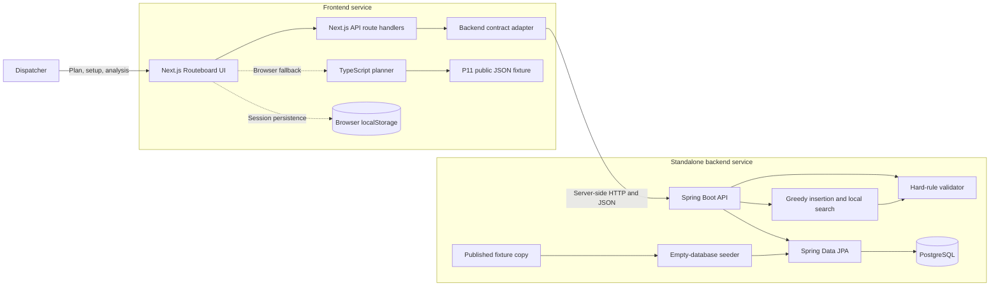
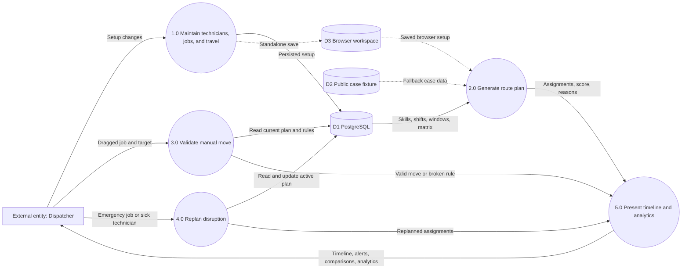

# Routeboard

Solution for **LofiStack Hackathon 2026 — P11**

## Project information

- **Team:** `Routeboard`
- **Team ID:** `LSH26-T053`
- **Problem:** `P11 — Route and Shift Assignment Optimisation`
- **Live application:** <https://routeboard-65q1.onrender.com/>
- **Live backend API:** <https://routeboard-api.onrender.com>
- **Backend health:** <https://routeboard-api.onrender.com/health>
- **API documentation:** <https://routeboard-api.onrender.com/swagger-ui.html>
- **Frontend repository:** <https://github.com/naeemsadik/LSH26-T053-P11>
- **Backend repository:** <https://github.com/naeemsadik/LSH26-T053-P11-Backend>
- **Demo video:** Not provided

> Judges will evaluate only the exact commit SHA entered in the Final Submission Form.

## Solution summary

Routeboard helps field-service dispatchers assign time-windowed jobs to qualified technicians while respecting skills, shifts, travel times, and customer promises. It generates an optimized daily plan, explains every unassigned job, supports validated manual changes and disruption replanning, and presents the result through a timeline, comparisons, and operational analytics.

## Requirements

| Requirement | Status | Where to verify |
|---|---|---|
| R1 — Technician, job, shift, skill, area, and travel data | Complete | Open **Technicians**, **Jobs**, and **Travel times** from the sidebar |
| R2 — Enforce skill, shift, travel, and customer-window rules | Complete | Select **Generate plan**, then inspect scheduled blocks and unassigned reasons |
| R3 — Greedy insertion and local-search optimization | Complete | Select **Generate plan**, then compare **Baseline** and **Working** plans |
| R4 — Timeline, score, risk, idle, and unassigned visibility | Complete | Open **Plan** and inspect the statistics bar, timeline, and unassigned panel |
| R5 — Validated manual reassignment | Complete | Drag a job to another technician row and inspect the rule result |
| R6 — Baseline comparison and operational analytics | Complete | Open **Compare** and **Analytics** |
| R7 — Emergency and sick-technician replanning | Complete | Select **Emergency job** or mark a technician unavailable from the timeline |
| R8 — Persisted setup and plan state | Complete | Edit setup, select **Save and update plan**, then reload the page |

## How to test the application

1. Open the [live application](https://routeboard-65q1.onrender.com/).
2. Select **Generate plan** and confirm the timeline, score, travel total, scheduled count, and explicit unassigned reasons update.
3. Drag a scheduled job to another technician row and confirm Routeboard either accepts the move or names the broken rule.
4. Open **Technicians**, **Jobs**, or **Travel times**, change a value, select **Save and update plan**, and reload to confirm persistence.
5. Open **Compare** and **Analytics** to review baseline savings, coverage, demand, skill capacity, and technician workload.
6. Add an emergency job or mark a technician unavailable and confirm pending work is replanned while completed or active work remains protected.

### Test or sample data

The frontend loads all 25 published cases directly from [`Data/P11_route_shift_public.json`](Data/P11_route_shift_public.json) when running without the Spring API. In browser mode, choose a case from the top-right selector; reset it by removing `routeboard-workspace-v1` from browser local storage and reloading.

For the connected backend, an empty PostgreSQL database is seeded from the same published fixture. `OPTIMIZER_SEED_CASE_ID` chooses the case and defaults to `PUB-01`; reset backend data by attaching an empty database and restarting the API.

## Run locally

### Requirements

- Git
- Docker Engine or Docker Desktop with Docker Compose
- At least 4 GB of available memory for the three-container stack

### Setup

```bash
git clone --recurse-submodules https://github.com/naeemsadik/LSH26-T053-P11.git
cd LSH26-T053-P11
cp frontend/.env.example frontend/.env.local
docker compose up --build
```

Open the frontend at `http://localhost:3000`, the API at `http://localhost:8080`, and Swagger UI at `http://localhost:8080/swagger-ui.html`.

The example environment files contain development placeholders only. Frontend variable names are `BACKEND_URL`, `BACKEND_HOSTPORT`, `PORT`, and `HOSTNAME`. Backend variable names are `DATABASE_URL`, `DB_USERNAME`, `DB_PASSWORD`, `SPRING_DATASOURCE_URL`, `PORT`, and `OPTIMIZER_SEED_CASE_ID`.

## Problem-solving approach

- **Understanding:** The team modeled the task as a small vehicle-routing problem with time windows where skills, shifts, travel, and customer windows are hard constraints.
- **Solution:** Jobs are ordered by window urgency and tested at every route insertion position; the lowest-travel feasible insertion wins, followed by bounded relocation and swap improvements.
- **Key decision:** One validator is reused by generation, drag reassignment, emergency replanning, and sick-day redistribution so no workflow can bypass a hard rule.
- **Testing:** The frontend suite covers workflows, persistence, narrow layouts, API validation, and hard-rule-safe partitions for all 25 published cases. The backend includes unit and full acceptance tests for validation, optimization, manual moves, and sick-technician redistribution.

## Architecture



## Data flow diagram



## Technology used

- **Frontend:** Next.js 16, React 19, TypeScript, CSS Modules, Lucide React
- **Backend:** Java 21, Spring Boot 3.3, Spring Data JPA, Hibernate
- **Database:** PostgreSQL 17; H2 for backend tests
- **Deployment:** Render Blueprints and multi-stage Docker images
- **Other material tools:** Playwright, ESLint, Maven, Docker Compose, Google Fonts, published P11 fixture

See [`LICENSES.md`](LICENSES.md) for third-party materials.

## Team contributions

| Registered member | GitHub username | Major contribution | Evidence |
|---|---|---|---|
| Naeem Abdullah Sadik | [`naeemsadik`](https://github.com/naeemsadik) | Frontend, browser planner, API integration, persistence, UI and analytics, public-data seed integration, deployment, testing, and documentation | `frontend/`, `Data/`, `Dockerfile`, `render.yaml`, commits `c8c7889` and `ad56a86` |
| Yeamim Hossain Sajid | [`yeamimhossainsajid`](https://github.com/yeamimhossainsajid) | Initial Spring backend, data models, controllers, assignment and local-search services, persistence, and backend tests | `backend/src/main/java/`, `backend/src/test/java/`, commit `06642cc` |

Commit count alone does not represent contribution.

## AI usage

| Tool | Assisted with | Verification |
|---|---|---|
| OpenAI Codex | Frontend and backend implementation support, UI refinement, API integration, deployment configuration, tests, debugging, and documentation | ESLint, TypeScript, six Playwright browser/API tests across all 25 published cases, responsive screenshots, production builds, API-contract review, and seed-schema checks |
| Google Antigravity | Initial Spring backend, assignment and local-search logic, persistence services, backend tests, and documentation | Review against P11 requirements, Spring unit and acceptance tests, and the Maven-based Render Docker build |

## Major design decisions

- **Shared hard-rule validator:** Every automatic and manual scheduling path uses the same feasibility checks, preventing inconsistent results.
- **Deterministic heuristic:** Greedy insertion plus bounded local search provides fast, explainable plans for the published problem size without a heavyweight solver.
- **Server proxy with browser fallback:** Connected deployments keep backend credentials and CORS concerns server-side, while the fixture-backed browser mode remains usable when the API is unavailable.
- **Focused dependency set:** Native drag events and CSS timeline/analytics views avoid additional chart and drag-and-drop libraries.

## Known limitations

- The live Spring API operates on one active dataset case at a time; selecting another seed case requires an empty database and `OPTIMIZER_SEED_CASE_ID` before startup.
- The prototype has no authentication or multi-tenant access control.
- Native HTML drag-and-drop is optimized for pointer devices and has no dedicated touch reordering interaction.

## Repository records

- [`EVENT.md`](EVENT.md) — event start code and pre-event-material declaration
- [`evaluation-manifest.json`](evaluation-manifest.json) — structured judging evidence
- [`LICENSES.md`](LICENSES.md) — frameworks, libraries, templates, fonts, icons, tools, and assets
