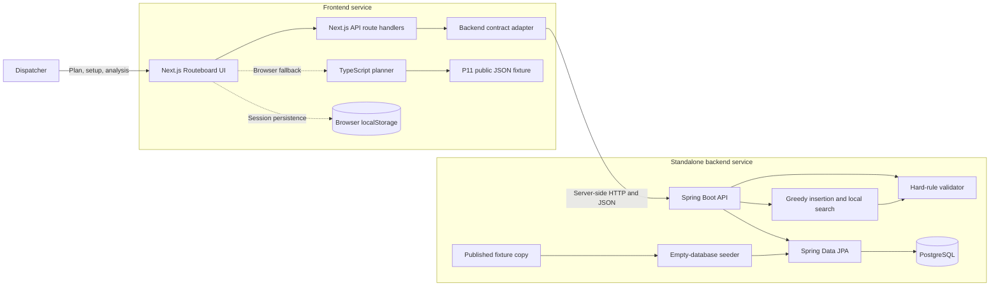
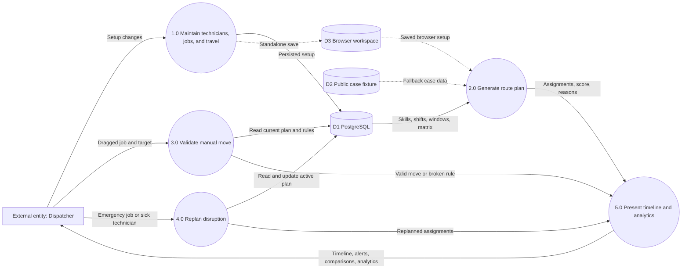

# Routeboard

Next.js dispatcher workspace for route and shift assignment optimization.

## Repositories

- Frontend: [naeemsadik/LSH26-T053-P11](https://github.com/naeemsadik/LSH26-T053-P11)
- Backend API: [naeemsadik/LSH26-T053-P11-Backend](https://github.com/naeemsadik/LSH26-T053-P11-Backend)

## Live deployment

- Frontend: [https://routeboard-65q1.onrender.com](https://routeboard-65q1.onrender.com/)
- Backend API: [https://routeboard-api.onrender.com](https://routeboard-api.onrender.com)
- Backend health: [https://routeboard-api.onrender.com/health](https://routeboard-api.onrender.com/health)
- API documentation: [https://routeboard-api.onrender.com/swagger-ui.html](https://routeboard-api.onrender.com/swagger-ui.html)

The `backend` entry in this repository is a Git submodule pointing to the
standalone backend repository. The Spring source and its deployment history
are maintained there, not duplicated here.

## Architecture



## Data flow diagram



## Local full stack

Clone both repositories and start the containers:

```bash
git clone --recurse-submodules https://github.com/naeemsadik/LSH26-T053-P11.git
cd LSH26-T053-P11
docker compose up --build
```

For an existing clone, initialize the backend once with:

```bash
git submodule update --init --recursive
```

- Frontend: `http://localhost:3000`
- API: `http://localhost:8080`
- Swagger: `http://localhost:8080/swagger-ui.html`

## Render deployment

1. Create a Blueprint from the [backend repository](https://github.com/naeemsadik/LSH26-T053-P11-Backend). It creates `routeboard-api` and `routeboard-db`.
2. Create a Blueprint from this repository. It creates the `routeboard` frontend and injects the existing API's public Render URL.

Do not create the backend as a standalone Web Service. Both Blueprints must be
in the same Render workspace. The frontend calls Spring only through server-side
Next.js route handlers, so no browser CORS configuration is required.

For a manually created frontend service, build the root `Dockerfile` and set
`BACKEND_URL` to the backend's public URL.
