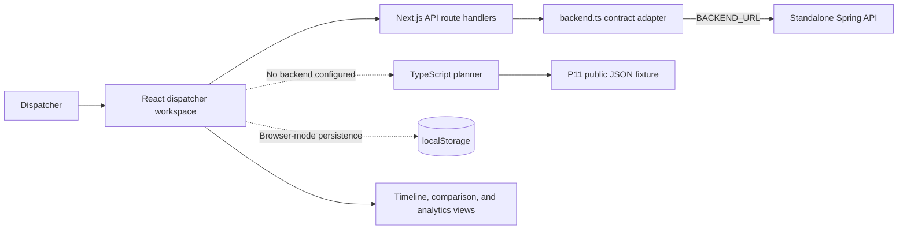
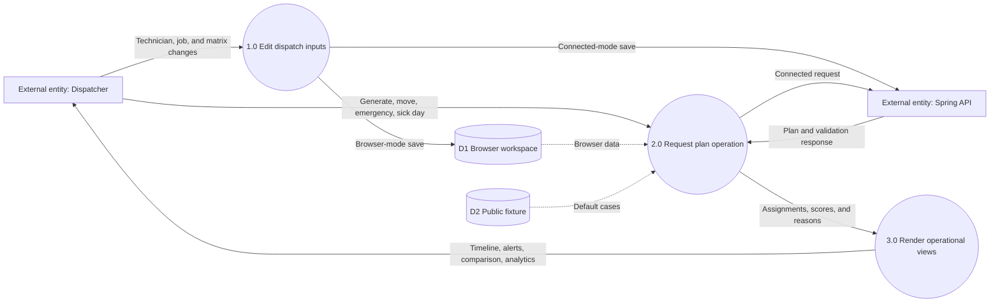

# Routeboard frontend

Desktop-first dispatcher workspace for P11 route and shift assignment optimisation.

## Live deployment

- Frontend: [https://routeboard-65q1.onrender.com](https://routeboard-65q1.onrender.com/)
- Backend API: [https://routeboard-api.onrender.com](https://routeboard-api.onrender.com)

## Architecture



## Data flow diagram



## Run

```bash
npm install
npm run dev
```

Open `http://localhost:3000`.

## Verify

```bash
npm run lint
npm test
npm run build
```

Install Playwright Chromium once when needed:

```bash
npx playwright install chromium
```

## Backend

The Spring API lives in the separate [Routeboard backend repository](https://github.com/naeemsadik/LSH26-T053-P11-Backend).

Set the server-only `BACKEND_URL` to its public API root. Render copies `routeboard-api`'s generated `RENDER_EXTERNAL_URL` into this variable. Without `BACKEND_URL` or `BACKEND_HOSTPORT`, the public-data workspace saves in browser storage for standalone frontend development. Connected paths:

- `POST /plan/generate`
- `POST /plan/validate-move`
- `POST /plan/move`
- `POST /plan/replan-active`
- `GET|POST /cases/:caseId` (Next.js adapter)
- `POST /technicians/:id/sick`

Initialize the backend submodule, then use `docker compose up --build` from the repository root to run the connected stack:

```bash
git submodule update --init --recursive
docker compose up --build
```
